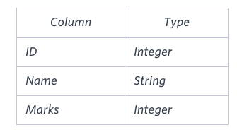

link :
https://www.hackerrank.com/challenges/more-than-75-marks

<pre>
Query the Name of any student in STUDENTS who scored higher than  Marks. Order
your output by the last three characters of each name. If two or more students
both have names ending in the same last three characters (i.e.: Bobby, Robby,
etc.), secondary sort them by ascending ID.
</pre>



<pre>
student 이름을 뽑는데 marks가 75보다 커야한다.
일단은 이름의 맨 끝 3자리로 소팅을하고 겹치는 애들이 있으면 id로 2차 소팅한다.
75보다 커야된다는 쉽다 : WHERE MARKS > 75
소팅 2번하는 것도 sql에서는 껌이다 ㅎ ORDER BY RIGHT(NAME,3), ID
오름차순을 뜻하는 ASC는 default라서 안써도된다. 쓰려면 맨 뒤에 ASC 쓰든가 ㅎ
</pre>

```sql
SELECT NAME FROM STUDENTS WHERE MARKS > 75 ORDER BY RIGHT(NAME,3), ID
```

