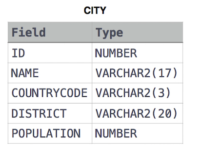

link :
https://www.hackerrank.com/challenges/revising-the-select-query-2

<pre>
Query the names of all American cities in CITY with populations larger than 120,000. 
The CountryCode for America is USA.
</pre>



<pre>
1번 문제랑 거~~~의 유사하다. 다만 전체 column이 name으로 바꼈다.
name column은 [Select NAME]
인구 120,000 보다 큰은 [where POPULATION > 120000]
미국도시는 [where COUNTRYCODE = 'USA']
합치면
</pre>

```sql
Select NAME from CITY where POPULATION > 120000 AND COUNTRYCODE = "USA"
```

