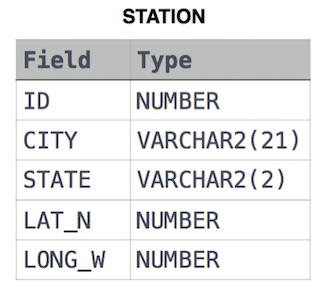

link :
https://www.hackerrank.com/challenges/weather-observation-station-1

<pre>
Query a list of CITY and STATE from the STATION table.</pre>



<pre>
쉬운거 안다. 쉬워도 다 쓴다. 왜냐면 겁나 한심했기 때문이다.
2개의 column만 뽑아오는 문제다. CITY랑 STATE
[Select CITY, STATE]
이렇게 콤마로 가져오면 된다.
</pre>

```sql
Select CITY, STATE from STATION
```

