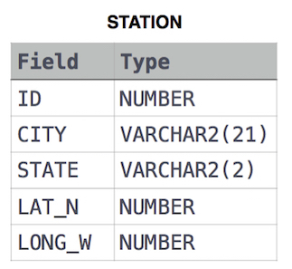

link :
https://www.hackerrank.com/challenges/weather-observation-station-5

<pre>
Query the list of CITY names starting with vowels (a, e, i, o, u) from STATION.
 Your result cannot contain duplicates.
</pre>



<pre>
CITY 이름을 가져오는데 모음으로 시작된 애들만 가져오고 중복은 제거해라.
중복 제거는 Select DISTINCT CITY
모음으로 시작하는 애들을 어떻게 할까.
정규표현식을 쓰면된다.
WHERE (column-name LIKE 'a%')
column-name(CITY)이 a로 시작하는 무언가다를 뜻한다.
OR를 이용해서 다른 모음들도 전부 넣어준다.
WHERE는 한번만 나오는거 주의! column-name은 각각 써주는것도 주의!
</pre>

```sql
Select DISTINCT CITY FROM STATION WHERE 
(CITY LIKE 'a%' OR CITY LIKE 'e%' OR CITY LIKE 'i%' OR CITY LIKE 'o%' OR CITY LIKE 'u%')
```

